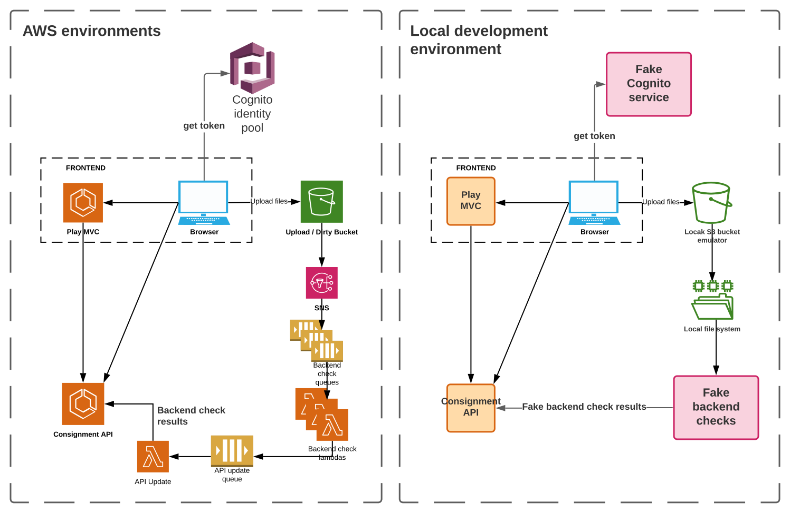

# TDR local AWS services

This repo is part of the [Transfer Digital Records][tdr-docs] project.

It emulates AWS services to allow us to build an entirely local development
environment.

The Cognito Identity Pool is replaced by a local fake Cognito server. The S3
upload bucket is replaced by a local S3 emulator which stores files to the
local file system. The backend check queues and lambdas are replaced by a
single Scala service which monitors the file system for "uploaded" files.

This diagram shows how the local development environment compares to the
real AWS environments. Some components like the auth server and database have
been omitted, because they are the same in both cases.



Diagram source: https://app.lucidchart.com/documents/edit/a198205b-4c4a-4674-ac8a-d1495f785677

[tdr-docs]: https://github.com/nationalarchives/tdr-dev-documentation/

## Local Cognito

The app runs an akka-http server which returns fake Cognito tokens that are
accepted by [S3 ninja].

To run the app from the command line, run:

```
sbt localCognito/run
```

Or run the `FakeCognitoServer` object from IntelliJ.

By default, the app runs on port 4600.

[S3 ninja]: https://s3ninja.net/

## Local backend checks

The `FakeBackendChecker` app watches the directory where the S3 emulator stores
uploaded files and saves fake check results to the API.

Unlike the real file checks, which run antivirus scans and perform real checksum
calculations, the fake checker generates fake results based on just the original
filename.

It currently only runs a fake virus scan and checksum, but will be updated to
support file format ID checks.

### Configure local Keycloak

- In your local Keycloak server, create a new client called `tdr-backend-checks`
- Set the Redirect URIs to `http://localhost:9000/*`
- Set the Access Type to "confidential"
- Set Service Accounts Enabled to "On"
- In the Roles tab, add the roles to give your client permission to call the
  Consignment API:
  - `antivirus`
  - `checksum`
  - `file_format`
  - `client_file_metadata`
- In the Service Account Roles tab, search for the Client Role called
  "tdr-backend-checks" and move the roles you just created from the Available
  Roles table to the Assigned Roles table

### Configure environment

Set the following environment variables before running `FakeBackendChecker`:

- `CLIENT_SECRET`: The client secret of the service client you created in Keycloak
- `S3_UPLOAD_DIRECTORY`: The directory that the S3 emulator saves files in. If you
  are running S3 ninja, this is the directory you mounted when you started the
  Docker container

### Run local backend checks

To run the app from the command line, run:

```
sbt backendChecks/run
```

Or run the `FakeBackendChecker` object from IntelliJ.

## Test filenames

Fake file checks generate their results based on the filenames

| Filename pattern | Examples                                     | Antivirus result       | Checksum result                                       | File format result |
| ---------------- | -------------------------------------------- | ---------------------- | ----------------------------------------------------- | ------------------ |
| *                | example.txt, stuff.doc                       | Success (empty string) | `fake-checksum`                                       | `x-fmt/111`        |
| eicar*           | eicar, eicar123.exe                          | `SUSP_Just_EICAR`      | `fake-checksum`                                       | `x-fmt/111`        |
| test-virus*      | test-virus, test-virus.txt                   | `test_virus`           | `fake-checksum`                                       | `x-fmt/111`        |
| test-checksum-*  | test-checksum-abcde, test-checksum-abcde.doc | Success (empty string) | `abcde` (or whatever was appended to `test-checksum-` | `x-fmt/111`        |
| test-checksum-*  | test-checksum-abcde, test-checksum-abcde.doc | Success (empty string) | `abcde` (or whatever was appended to `test-checksum-` | `x-fmt/111`        |
| test-fmt-*       | test-fmt-123, test-fmt-123.txt               | Success (empty string) | `fake-checksum`                                       | `fmt/123`          |
| test-x-fmt-*     | test-x-fmt-456, test-x-fmt-456.txt           | Success (empty string) | `fake-checksum`                                       | `x-fmt/123`        |
